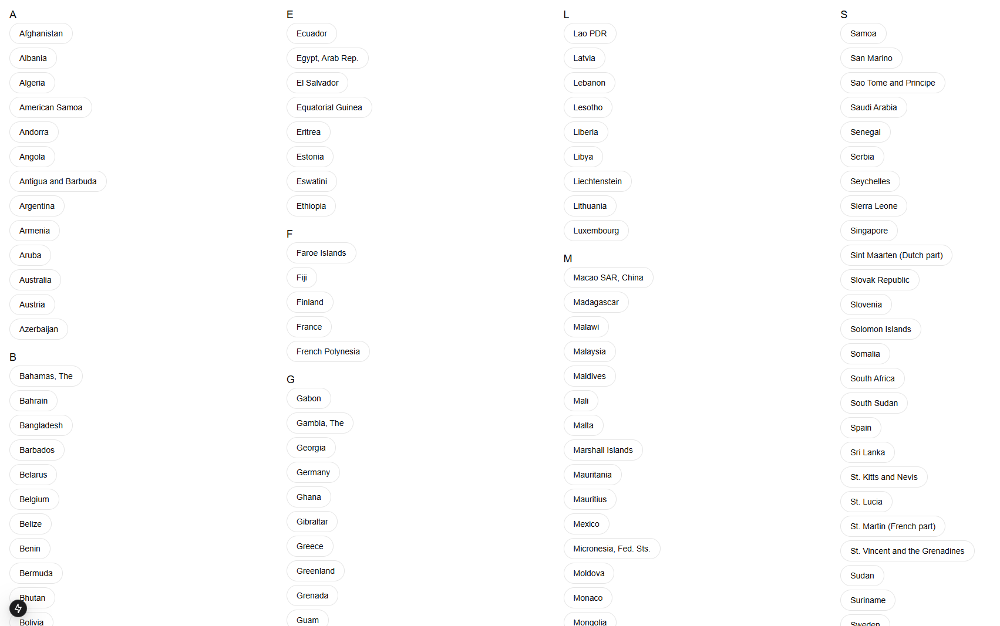
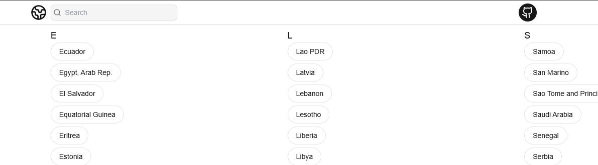
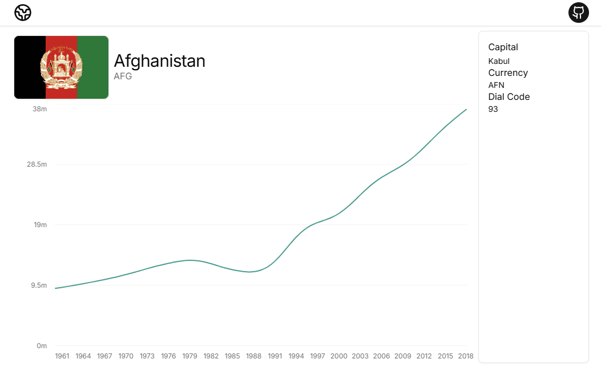
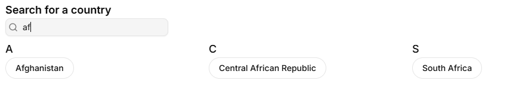
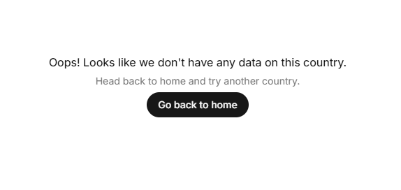
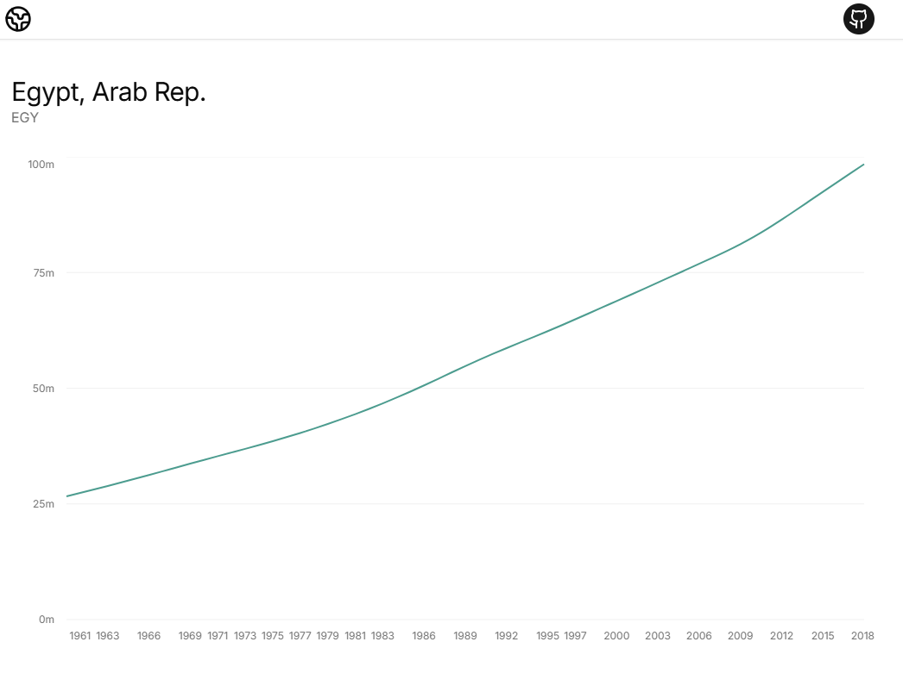
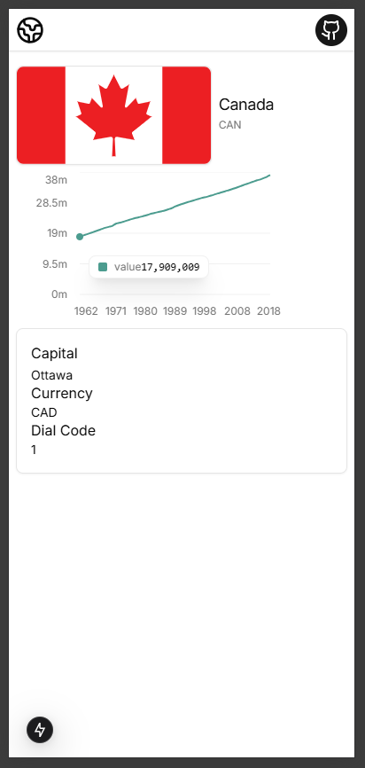
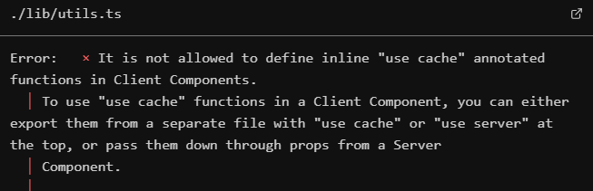
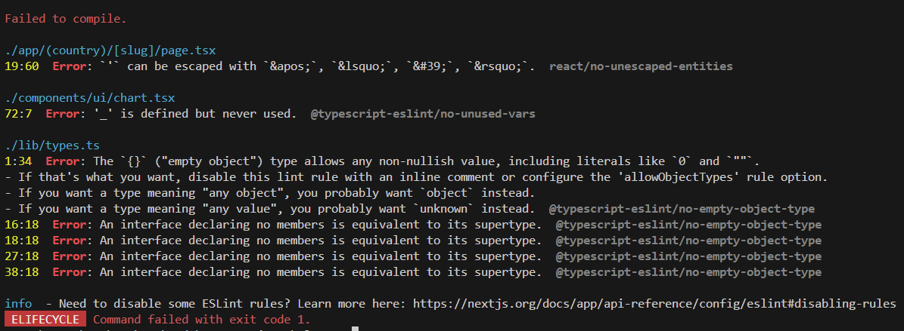

# Elanco Interview Task

## Initial Thoughts

**Reqs:** Web app, displays country (w/ population data) from REST API, easy way to visualise how many people live in each country

**Notes:** Have freedom to choose whatever tool or programming language

**Initial thoughts for implementation**:
- Next.js for frontend as it is a tool I have experience using
- ShadCN UI for quick development of feature rich UI

## Development
### The APIs
The first essential feature that needs to be tested and implemented is the fetching of data from the provided API.

After going through the [API documentation](https://documenter.getpostman.com/view/1134062/T1LJjU52#intro) and testing some of the outputs using the code bellow I outlined the following API routes which will probably be useful:

```ts
export default async function Home() {
  const response = await fetch('https://countriesnow.space/api/v0.1/countries/capital');
  const data = await response.json();

  return (
    <div>
      {JSON.stringify(data["data"])}
    </div>
  );
}
```

- `https://countriesnow.space/api/v0.1/countries/population`
  - `GET` all population data for all countries (+more)
  - `POST` for specific country population data

- `https://countriesnow.space/api/v0.1/countries/flag/images`
  - `POST` for specific country flag

- `https://countriesnow.space/api/v0.1/countries/info`
  - `GET` for info dependent on params for countries

### Implementation Plan
My first intuition as to how implement this would be to have a list of all countries on the home page, represented as links to their own respective information page which will display the population data.

So there will be [dynamic route](https://nextjs.org/docs/app/building-your-application/routing/dynamic-routes) for the countries where the slug will be the country name. Using the slug we will fetch the countries relevant data.

**Technical Decisions:**
- Next.js 15 to make use of new "use cache" directive to reduce latency
- TailwindCSS & ShadCN UI / Charts for quick development of UI 

## Creating Core Functionality
Before I start working on the UI I'm want to create the core functionality. 

**Utils:**

My first step was to create some reusable util functions for fetching the data. 

The util functions I made where:
- `getAllPopulations` gets all population counts for all categories
- `getAllCountriesPopulations` gets all population counts for countries only
- `getCountryPopulation(code)` gets population count for specific country (takes country code as param)
- `getCountryFlag(code)` gets countries flag (takes country code as param)
- `getAllCountriesInfo` gets all countries info (capital, currency, flag, dialCode, unicodeFlag)
- `getCountryInfo` gets info for specific country (same info as prev)

The benefit of doing this as opposed to just fetching within the component/page is:
  1. Reduces and redundant repeated code
  2. Added type safety for return types.

**Dynamic Route:**

Next I made a very simplistic version of the dynamic route setup. It simply uses the slug to display the JSON data retrieved from the `getCountryInfo` and `getCountryPopulation` using the slug.

```ts
// (country)/[slug]/page.tsx
import { getCountryInfo, getCountryPopulation } from "@/lib/utils";

export default async function CountryPage({ params }: { params: { slug: string } }) {
  const { slug } = await params;
  const country = decodeURI(slug);
  const info = await getCountryInfo(country);
  const population = await getCountryPopulation(country);

  return (info && population) && (
    <div>
      {JSON.stringify(info)}
      {JSON.stringify(population)}
    </div>
  );
}
```

So as of now the output for the dynamic route is this (for Afghanistan):


### Developing UI
**Sketches:**

First thing I did was do some quick sketches in [excalidraw](https://excalidraw.com) of how I think the UI should be structured. 

Home page:


Country page:


**UI Prerequisites:**

First things first I added some ShadCN components that I think I'm going to use. I did this by running the following commands:

```
pnpm dlx shadcn@latest init
```

```
pnpm dlx shadcn@latest add button card chart label
```

**Home Page UI:**
First piece of the UI I chose to develop was the home page, the list / index of all countries.

This was pretty simple to implement. The most complex aspect of this was the grouping of countries by name. This was achieved by creating a new map which maps each letter of the alphabet to an array of all countries starting with that letter. Shown in the code below:

```ts
  const groupedCountries = countries.reduce((group, item) => {
    const firstLetter = item.country[0].toUpperCase();
    if (!group[firstLetter]) {
      group[firstLetter] = [];
    }
    group[firstLetter].push(item);
    return group;
  }, {} as GroupedCountries);
```

Then I simply mapped an array of letters (derived from the keys of `groupedCountries`) to the page which in turn maps all countries from the `groupedCountries` to a `Link` component. The `Link` link component has the prefetch flag so that it prefetches the route when hovered.

Then finally I had to play around with the styles to get the column layout. In the end I used the `columns-x` and `break-inside-avoid` utlities on the container and children, respectively. 

The outcome was this:


**Shared UI Features:**

The main UI feature which is shared accross pages is the header. This will just have some nav links and on the home page I intend in implementing a search bar to filter through the countries.

The header can be placed in the [`layout.tsx`](https://nextjs.org/docs/app/building-your-application/routing/layouts-and-templates) so it will be displayed accross all pages. This is what I implemented:



**Country Page UI:**

The first parts of this page I implemented was the header which displayed the flag, country name, and country code. This makes use of the Next.js [`Image`](https://nextjs.org/docs/app/api-reference/components/image) component, this allows us to leverage some image optimisation provided by Next. 

Then I implemented the sidebar which was just a simple div with some static content.

Finally I added the graph for displaying the population over the previous years. I used the [ShadCN Charts](https://ui.shadcn.com/charts) components to display this data. It is built on top of [Rechart](https://recharts.org/en-US/) and allows for the easy implementation of high quality feature rich graphs and charts. All I had to do was pass the `populationCounts` object to it and do some configuration so that it would display the data correctly. The outcome was the following:



**Search Functionality:**

In order to implement the search functionality I had to re-think the structure / placing of my search bar. As it was only used in one location (the home page) I decided that it would not be needed to have the search bar in the header. Also the added complexity of a state management system like zustand/context API seemed like over engineering for the simple purpose of filtering an array. 

Therefore, I decided to move the search bar onto the home page it self. Initially I thought I'd just put it on the home page component it self and then apply the filter to the `allCountries` fetched from the util function. However, after consideration, I decided that this would not be a good decision as it would mean that the [`Countries`](components/home/countries.tsx) component would run the grouping process everytime that array was eddited. So instead I placed the search bar within the `Countries` component so that it could filter the grouped countries.

This is what UI now looks like:



### Final Improvements
There are some final improvements I would like to make. They are:
- Implement the use of the [`"use cache"`](https://nextjs.org/docs/canary/app/api-reference/directives/use-cache) directive for util functions.
- Ensure correct handling of errors/null values
- Ensure responsiveness of UI

**Handling of errors/null values:**

If the info or population data fetched in the country page is null, because either the data does not exist for that country or the country itself does not exist, the app should display some kind of message informing the user that there is no data. My solution for this was just to add this conditional rendering statement in the country page.

```ts
  // ...
  return (!population || !info) ? (
    <main className="flex flex-col mx-auto h-screen md:max-w-5xl items-center justify-center gap-2 p-2">
      <h1 className="leading-tight">Oops! Looks like we don't have any data on this country.</h1>
      <h2 className="text-sm leading-tight text-muted-foreground">Head back to home and try another country.</h2>
      <Link
        href="/"
        prefetch
      >
        <Button
          className="px-4 rounded-full"
          size="sm"
        >
          Go back to home
        </Button>
      </Link>
    </main>
  ) : (
  // ...
```

Which provides the following input if `info` or `population` are null:



> **This was incorrect** <br> 
My assumption was that all valid countries would have a info and population record. However, there were cicumstances where they did not, where `info` was undefined. So I had to re think how to deal with null/undefined values on this page. What I actually implemented was this: <br>
```ts
return (!population) ? (
  // ...
  ) : (
    <main>
        <div>
          {info?.flag && (
            // ...
          )}
          <div>
            <h1>{country}</h1>
            <span>{population?.code}</span>
          </div>
        </div>
        <Chart populationData={population.populationCounts} />
      </section>
      {info && (
        // ...
      )}
    </main>
  );
```

> This allowed the country page to deal with null/undefined values of info whilst still being able to display population data.



**Responsiveness of UI:**

This feature was pretty simple to implement as I had been keeping in mind responsiveness whilst I built most of the app. However, there were a cases where it could be improved.

These improvements were mostly done on the country page where I had to deal with responsive flexbox layouts to change the positioning of the sidebar to a header on smaller viewports.

So now the sidebar falls under the graph when on smaller viewports:


**`"use cache"` Directive:**

In order to make use of the "use cache" directive you have to turn on the experimental `dynamicIO` flag:


```ts
// next.config.ts
import type { NextConfig } from 'next';
 
const nextConfig: NextConfig = {
  experimental: {
    dynamicIO: true,
  },
}
 
export default nextConfig;
```

Initially when I tried implementing the inline `"use cache"` for each function in the utils file I was being met with this error:



As stated by the error message in order to implement the `"use cache"` directive I would not be able to use it inline and instead would have to place it at the file level. This caused an issue as there were other functions in the utils that where not async and all functions `"use cache"` file must be async. 

This gave me an opportunity to seperate the fferent parts of the utils file so that it was better organised. I seperated the `lib` dir into:

- [`types`](lib/types.ts) - all the types used accross the app
- [`fetch`](lib/fetch.ts) - all the fetch utils (w/ `"use cache"` at top) 
- [`utils`](lib/utils.ts) - the remaning sync utils

This allowed me to successfully implement the caching of those fetch utilities.

### Deployment

In order to deploy the app I first had to check that it would build correctly by running:

```
pnpm run build
```

When I ran this it outlined some errors in the build process that would prevent me from deploying the site. These were:



The first two build errors where easy to fix, just simple swaps/changes.

The issues with the types required a little more effort. I was using a generic type for the API response that passes in the type of the data returned in the fetch request response. Then to create the types for each different fetch utility I would just extend `APIResponse` type passing in the type for the data as the generic. The issue is that my linter doesn't like having empty types, meaning that there is probably a better implementation of what I was trying to achieve. 

So in order to fix this issue I simply changed them from interfaces to types. E.g:

```ts
export ingerface AllCountriesInfoResponse extends APIResponse<CountriesInfo[]> {};

// Changed to...

export type AllCountriesInfoResponse = APIResponse<CountriesInfo[]>;
```

This is a much clearer representation of the type.

The final build error which I found was an issue with the country page. As I was accessing dynamic data through the params it required the use of a `Suspense` boundary to deal with the loading state. Next's `loading.tsx` works as a `Suspense` boundary for the route it is placed in, therefore, all I needed to do was implement a `loading.tsx` in the `(country)/[slug]` path.

After that the build process was able to run successfully and I was ready to deploy.


Deploying the web app was very simple. I used vercel to deploy it as it takes minimal setup and 0 cost for my level of usage for this web app. The deployment can be viewed at
[`elanco.mosly.dev`](https://elanco.mosly.dev).

