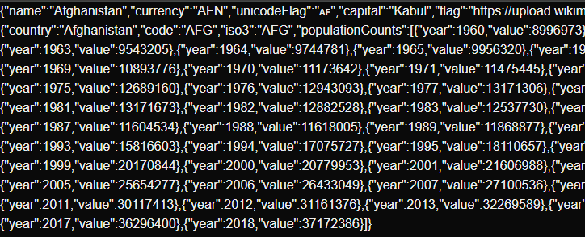
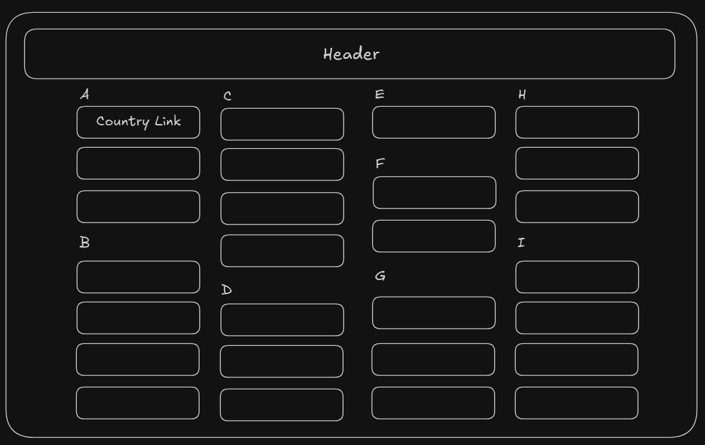
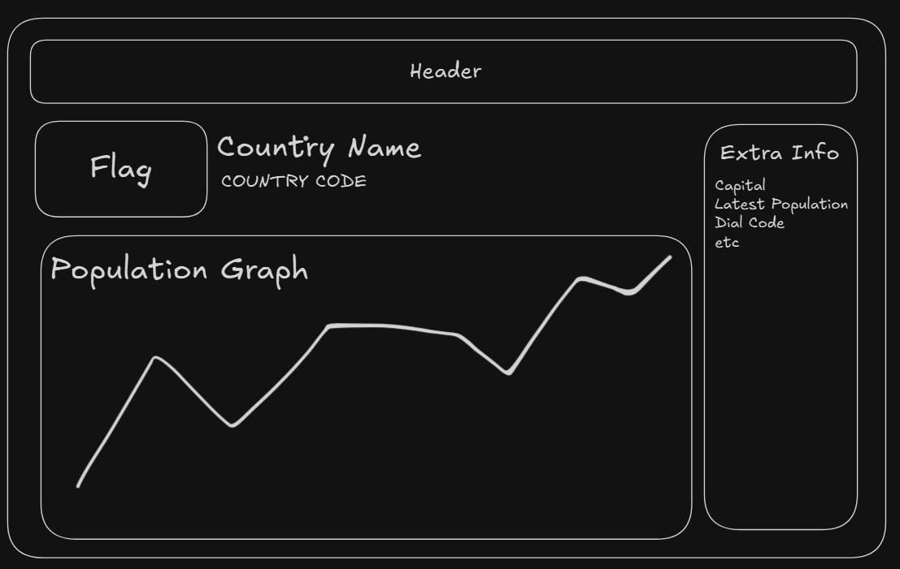

# Elanco Interview Task

## Initial Thoughts

**Reqs:** Web app, displays country (w/ population data) from REST API, easy way to visualise how many people live in each country

**Notes:** Have freedom to choose whatever tool or programming language

**Initial thoughts for implementation**:
- Next.js for frontend as it is a tool I have experience using
- ShadCN UI for quick development of feature rich UI

## Development
### The APIs
The first essential feature that needs to be tested and implemented is the fetching of data from the provided API.

After going through the [API documentation](https://documenter.getpostman.com/view/1134062/T1LJjU52#intro) and testing some of the outputs using the code bellow I outlined the following API routes which will probably be useful:

```ts
export default async function Home() {
  const response = await fetch('https://countriesnow.space/api/v0.1/countries/capital');
  const data = await response.json();

  return (
    <div>
      {JSON.stringify(data["data"])}
    </div>
  );
}
```

- `https://countriesnow.space/api/v0.1/countries/population`
  - `GET` all population data for all countries (+more)
  - `POST` for specific country population data

- `https://countriesnow.space/api/v0.1/countries/flag/images`
  - `POST` for specific country flag

- `https://countriesnow.space/api/v0.1/countries/info`
  - `GET` for info dependent on params for countries

### Implementation Plan
My first intuition as to how implement this would be to have a list of all countries on the home page, represented as links to their own respective information page which will display the population data.

So there will be [dynamic route](https://nextjs.org/docs/app/building-your-application/routing/dynamic-routes) for the countries where the slug will be the country name. Using the slug we will fetch the countries relevant data.

**Technical Decisions:**
- Next.js 15 to make use of new "use cache" directive to reduce latency
- TailwindCSS & ShadCN UI / Charts for quick development of UI 

## Creating Core Functionality
Before I start working on the UI I'm want to create the core functionality. 

**Utils:**

My first step was to create some reusable util functions for fetching the data. 

The util functions I made where:
- `getAllPopulations` gets all population counts for all categories
- `getAllCountriesPopulations` gets all population counts for countries only
- `getCountryPopulation(code)` gets population count for specific country (takes country code as param)
- `getCountryFlag(code)` gets countries flag (takes country code as param)
- `getAllCountriesInfo` gets all countries info (capital, currency, flag, dialCode, unicodeFlag)
- `getCountryInfo` gets info for specific country (same info as prev)

The benefit of doing this as opposed to just fetching within the component/page is:
  1. Reduces and redundant repeated code
  2. Added type safety for return types.

**Dynamic Route:**

Next I made a very simplistic version of the dynamic route setup. It simply uses the slug to display the JSON data retrieved from the `getCountryInfo` and `getCountryPopulation` using the slug.

```ts
// (country)/[slug]/page.tsx
import { getCountryInfo, getCountryPopulation } from "@/lib/utils";

export default async function CountryPage({ params }: { params: { slug: string } }) {
  const { slug } = await params;
  const country = decodeURI(slug);
  const info = await getCountryInfo(country);
  const population = await getCountryPopulation(country);

  return (info && population) && (
    <div>
      {JSON.stringify(info)}
      {JSON.stringify(population)}
    </div>
  );
}
```

So as of now the output for the dynamic route is this (for Afghanistan):


### Developing UI
First thing I did was do some quick sketches in [excalidraw](https://excalidraw.com) of how I think the UI should be structured. 

Home page:


Country page:


